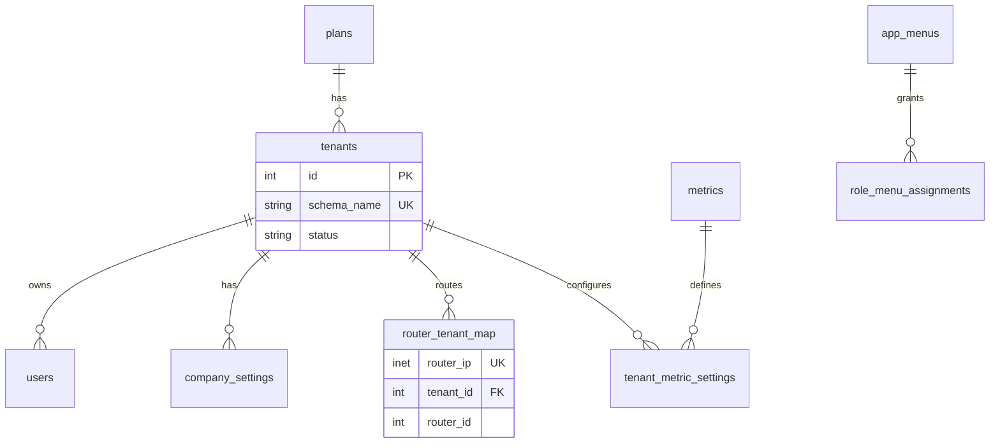

# Database schema reference

## Public schema (`public`)

| Table | Purpose |
|-------|---------|
| `schema_migrations` | Applied migration versions |
| `plans` | Subscription tiers (Starter, Pro, …) |
| `tenants` | ISP customers; each has isolated `schema_name` |
| `users` | Auth users (operator, super_admin, viewer, demo) |
| `btrc_config` | BTRC regulator settings |
| `btrc_submissions` | Export batch history |
| `nat_logs` | Cross-tenant NAT archive for BTRC CSV/JSON |
| `metrics` | Chart definitions (bandwidth, users, …) |
| `tenant_metric_settings` | Per-tenant chart visibility |
| `metric_data` | Time-series chart values |
| `app_menus` | Sidebar menu items |
| `role_menu_assignments` | Role → menu permissions |
| `company_settings` | Per-tenant branding & contact |
| `db_backups` | Backup file history |
| `demo_requests` | Marketing demo form submissions |
| `router_tenant_map` | MikroTik IP → tenant routing |

## Per-tenant schema (`tenant_NNN`)

Created by `public.create_tenant_schema(name)`.

| Table | Purpose |
|-------|---------|
| `syslogs` | Legacy syslog rows (fallback queries) |
| `devices` | MikroTik / NAS device registry |
| `routers` | NAT gateways sending syslog |
| `pppoe_users` | Subscriber session registry |
| `session_logs` | **Primary** MikroTik ingest table |

## ER (simplified)

## Tenant lifecycle

1. `INSERT INTO public.tenants …`
2. `SELECT public.create_tenant_schema('tenant_002');`
3. Register MikroTik: `devices` + `routers` + `router_tenant_map`
4. Syslog ingest → `session_logs` + `pppoe_users`

## Files

| Path | Content |
|------|---------|
| `database/schema/public/*.sql` | DDL only |
| `database/schema/tenant/functions.sql` | `create_tenant_schema` / `drop_tenant_schema` |
| `database/schema/seeds/*.sql` | Dev/demo data |
| `database/manifest.mjs` | Apply order |
| `database/scripts/setup.mjs` | Fresh install |
| `database/scripts/migrate.mjs` | Versioned patches |

Legacy SQL in `scripts/` is kept for backward compatibility; **prefer `database/`** for new changes.
